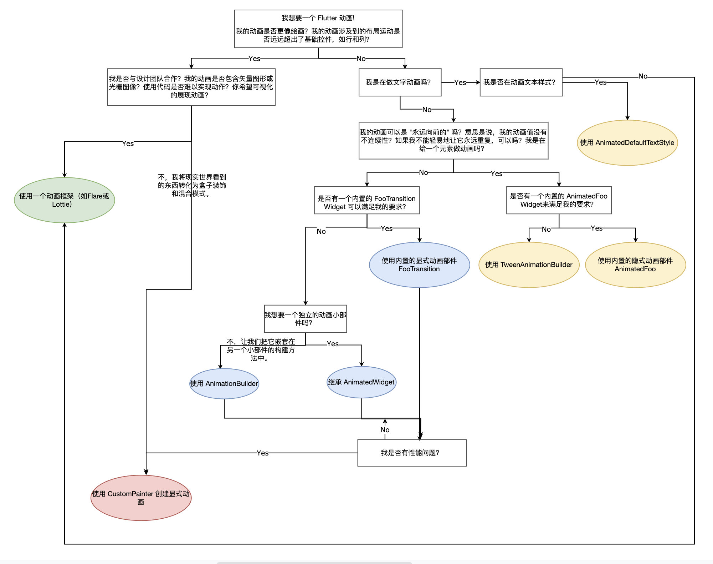

如何在 Flutter 中选择合适的动画 Widget 中文翻译

<!--more-->

## 前言

Flutter 团队推出了一个关于 [如何在 Flutter 中选择合适的动画 Widget](https://www.youtube.com/watch?v=GXIJJkq_H8g) 的视频以及配套的文章 [How to Choose Which Flutter Animation Widget is Right for You?
](https://medium.com/flutter/how-to-choose-which-flutter-animation-widget-is-right-for-you-79ecfb7e72b5) 都挺有好的，所以将文中的选择图翻译出来。

## 英文版

## 中文版

## 参考

[How to Choose Which Flutter Animation Widget is Right for You?
](https://medium.com/flutter/how-to-choose-which-flutter-animation-widget-is-right-for-you-79ecfb7e72b5)
