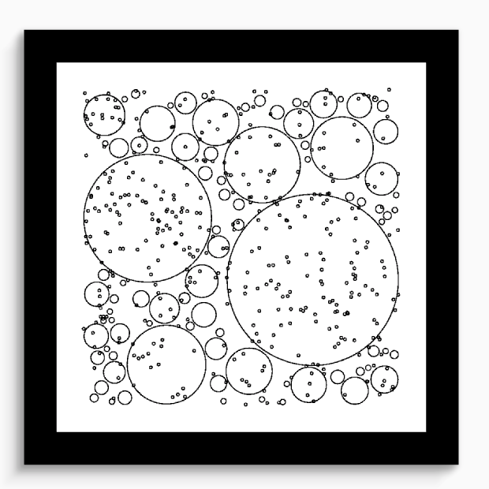
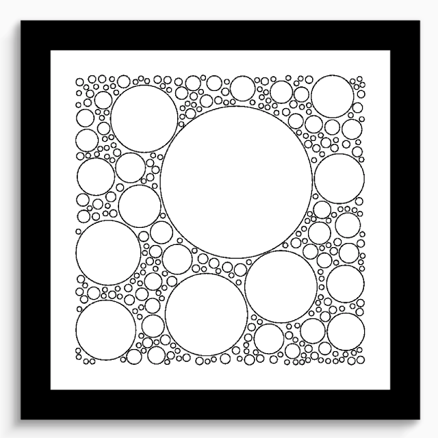

本文讲解使用 Flutter 实现 Generative Artistry 教程里面的第六个图形 Circle Packing（圆形填充）

<!--more-->

## 前言

懒癌发作，好久没写博客了...

本文讲解使用 Flutter 实现 [Generative Artistry](https://generativeartistry.com/tutorials) 教程里面的第六个图形 Circle Packing（圆形填充）。

实现这个图形的思路大致是：

1. 创建一个圆。
2. 判断这个圆是否与其他圆发生碰撞。
3. 没有则不断增大圆的半径，再次进行碰撞检测，直至最大半径。
4. 绘制更多的圆形，重复以上。

## 初始化

照旧创建一个 `CirclePacking` 控件以及 `CirclePackingPainter`。

```dart
class CirclePacking extends StatelessWidget {
  @override
  Widget build(BuildContext context) {
    return CustomPaint(
      painter: CirclePackingPainter(),
    );
  }
}

class CirclePackingPainter extends CustomPainter {
  @override
  void paint(Canvas canvas, Size size) {}

  @override
  bool shouldRepaint(CirclePackingPainter oldDelegate) => true;
}
```

然后定义一个 `Circle` 类，代表绘制的圆形。

```dart
class Circle {
  Point center;
  double radius;
}
```

在声明绘制需要的变量。

```dart
// 生成的圆形数组
List<Circle> circles = [];
// 圆形的最小半径
double minRaidus = 2;
// 圆形的最大半径
double maxRaidus = 100;
// 圆形的总数
int totalCircles = 500;
// 尝试绘制圆形的总数
int createCircleAttemps = 500;
// 随机因子
Random random = Random();
```

## 创建圆形

使用 `_createCircles` 方法生成需要绘制的圆形。

```dart
void _createCircles(Canvas canvas, Size size) {
  Circle circle = Circle()
    ..radius = minRaidus
    ..center = Point(
      random.nextDouble() * size.width,
      random.nextDouble() * size.height,
    );

  // 如果没有检测到碰撞，一直增大圆形的半径
  for (var i = minRaidus; i < maxRaidus; i++) {
    circle.radius = i;
    if (_doesHaveCollision(circle, size)) {
      circle.radius--;
      break;
    }
  }

  circles.add(circle);
}
```

使用 `_doesHaveCollision` 方法进行碰撞检测，目前都返回 `false`。

```dart
bool _doesHaveCollision(Circle circle, Size size) {
  return false;
}
```

## 绘制圆形

创建一个 `_drawCircles` 方法绘制圆形。

```dart
void _drawCircles(Canvas canvas) {
  Paint paint = Paint()
    ..strokeWidth = 0.5
    ..isAntiAlias = true
    ..color = Colors.black
    ..style = PaintingStyle.stroke;

  circles.asMap().forEach((key, circle) {
    final Offset offset = Offset(circle.center.x, circle.center.y);
    canvas.drawCircle(offset, circle.radius, paint);
  });
}
```

在 `paint` 方法里调用创建和绘制圆形的方法。

```dart
@override
void paint(Canvas canvas, Size size) {
  for (var i = 0; i < totalCircles; i++) {
    _createCircles(canvas, size);
    _drawCircles(canvas);
  }
}
```

噔噔噔，一团乱麻！


## 碰撞检测

完善圆形之间的碰撞检测方法 `_doesHaveCollision`。

```dart
bool _doesHaveCollision(Circle circle, Size size) {
  // 这里进行传入圆形与其他圆形的碰撞检测
  for (var i = 0; i < circles.length; i++) {
    Circle otherCircle = circles[i];
    double r2 = circle.radius + otherCircle.radius;

    // 判断两圆圆心的距离是否小于它们的半径和
    if (r2 >= circle.center.distanceTo(otherCircle.center) - 1) {
      return true;
    }
  }

  // 这里判断圆形是否超过左右边界
  if (circle.center.x + circle.radius >= size.width ||
      circle.center.x - circle.radius <= 0) {
    return true;
  }
  // 这里判断圆形是否超过上下边界
  if (circle.center.y + circle.radius >= size.height ||
      circle.center.y - circle.radius <= 0) {
    return true;
  }

  return false;
}
```



最后需要做的是在创建圆形之前的检测，更新创建圆形的方法 `_createCircles`。

```dart
void _createCircles(Canvas canvas, Size size) {
  Circle circle;
  bool circleSafeToDraw = false;

  // 使用尝试绘制圆形的次数进行循环
  for (var i = 0; i < createCircleAttemps; i++) {
    circle = Circle()
      ..radius = minRaidus
      ..center = Point(
        random.nextDouble() * size.width,
        random.nextDouble() * size.height,
      );

    // 如果碰撞检测失败跳过这个圆形，进行下一次尝试
    // 否则跳出循环将这个圆形加入 circles 数组
    if (_doesHaveCollision(circle, size)) {
      continue;
    } else {
      circleSafeToDraw = true;
      break;
    }
  }

  if (!circleSafeToDraw) {
    return;
  }

  // 不断增大圆形的半径
  for (var i = minRaidus; i < maxRaidus; i++) {
    circle.radius = i;
    if (_doesHaveCollision(circle, size)) {
      circle.radius--;
      break;
    }
  }

  circles.add(circle);
}
```

大功告成 🎉



最终代码

```dart
import 'dart:math';

import 'package:flutter/material.dart';

class Circle {
  Point center;
  double radius;
}

class CirclePacking extends StatelessWidget {
  @override
  Widget build(BuildContext context) {
    return CustomPaint(
      painter: CirclePackingPainter(),
    );
  }
}

class CirclePackingPainter extends CustomPainter {
  // 生成的圆形数组
  List<Circle> circles = [];
  // 圆形的最小半径
  double minRaidus = 2;
  // 圆形的最大半径
  double maxRaidus = 100;
  // 圆形的总数
  int totalCircles = 500;
  // 尝试绘制圆形的总数
  int createCircleAttemps = 500;
  // 随机因子
  Random random = Random();

  void _createCircles(Canvas canvas, Size size) {
    Circle circle;
    bool circleSafeToDraw = false;

    for (var i = 0; i < createCircleAttemps; i++) {
      circle = Circle()
        ..radius = minRaidus
        ..center = Point(
          random.nextDouble() * size.width,
          random.nextDouble() * size.height,
        );

      // 如果碰撞检测失败跳过这个圆形，进行下一次尝试
      // 否则跳出循环将这个圆形加入 circles 数组
      if (_doesHaveCollision(circle, size)) {
        continue;
      } else {
        circleSafeToDraw = true;
        break;
      }
    }

    if (!circleSafeToDraw) {
      return;
    }

    // 不断增大圆形的半径
    for (var i = minRaidus; i < maxRaidus; i++) {
      circle.radius = i;
      if (_doesHaveCollision(circle, size)) {
        circle.radius--;
        break;
      }
    }

    circles.add(circle);
  }

  bool _doesHaveCollision(Circle circle, Size size) {
    // 这里对传入的圆形与其他绘制圆形的检测
    for (var i = 0; i < circles.length; i++) {
      Circle otherCircle = circles[i];
      double r2 = circle.radius + otherCircle.radius;

      // 判断两个圆形圆心的距离是否小于两圆形的半径和
      if (r2 >= circle.center.distanceTo(otherCircle.center) - 1) {
        return true;
      }
    }

    // 这里判断圆形是否超过左右边界
    if (circle.center.x + circle.radius >= size.width ||
        circle.center.x - circle.radius <= 0) {
      return true;
    }
    // 这里判断圆形是否超过上下边界
    if (circle.center.y + circle.radius >= size.height ||
        circle.center.y - circle.radius <= 0) {
      return true;
    }

    return false;
  }

  void _drawCircles(Canvas canvas) {
    Paint paint = Paint()
      ..strokeWidth = 0.5
      ..isAntiAlias = true
      ..style = PaintingStyle.stroke;

    circles.asMap().forEach((key, circle) {
      paint.color = Colors.black;
      Offset offset = Offset(circle.center.x, circle.center.y);
      canvas.drawCircle(offset, circle.radius, paint);
    });
  }

  @override
  void paint(Canvas canvas, Size size) {
    for (var i = 0; i < totalCircles; i++) {
      _createCircles(canvas, size);
      _drawCircles(canvas);
    }
  }

  @override
  bool shouldRepaint(CirclePackingPainter oldDelegate) => true;
}

```
