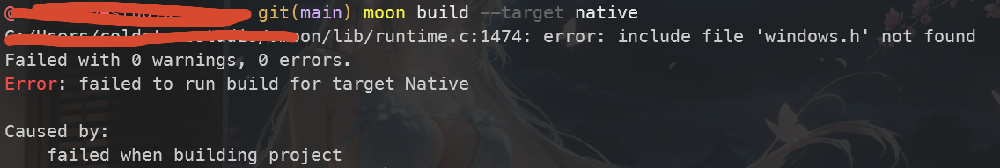
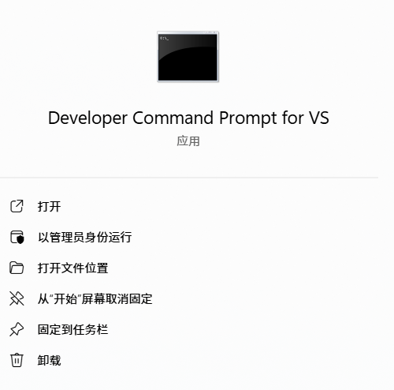
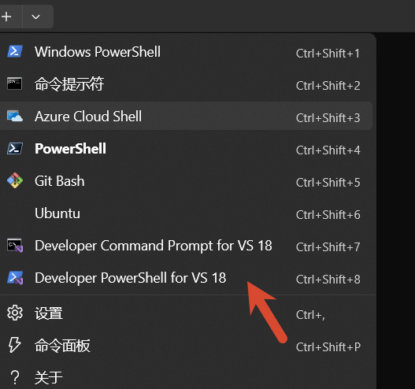
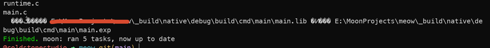
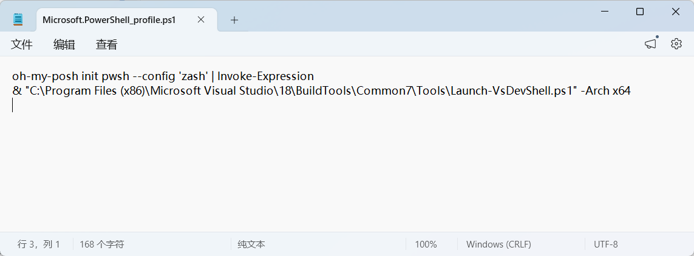
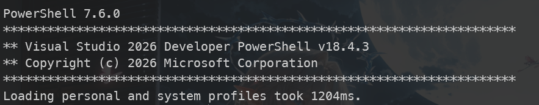

<!-- more -->

## 起因

昨晚入门学 MoonBit，写了一个很简单程序。

但是构建失败了，提示说没有找到 build 命令。



一番搜索，发现是因为没有添加环境变量。

## 解决方法

### 方法一：直接使用 Developer PowerShell 执行 build

安装 Visual Studio 生成工具后，会同时安装 Developer PowerShell。

开始菜单中输入内容进行搜索对话框中，输入 "developer powershell"，点击打开 



或者在 Windows Terminal 中打开 Developer PowerShell。



在这里面执行 build 命令即可构建成功。



### 方法二：在 $PROFILE 中添加环境变量

在 powershell 中执行以下命令，打开 $PROFILE 文件。

```ps
notepad $PROFILE
```

添加一行

```
& "C:\Program Files (x86)\Microsoft Visual Studio\18\BuildTools\Common7\Tools\Launch-VsDevShell.ps1" -Arch x64
```



这样在 powershell 启动是会自动加上所需的环境变量。

这也是可以构建成功的！

但是会很影响 powershell 启动速度，所以建议使用方法一。

