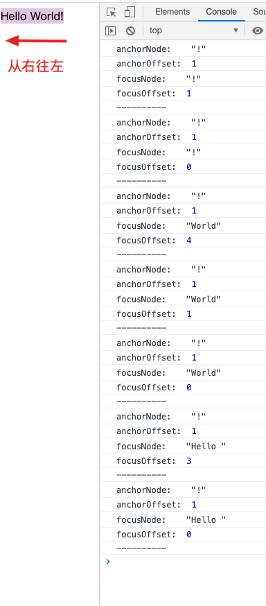

浏览器的 Range 和 Selection 对象

<!--more-->

## 前置知识

DOM 文档对象模型中总共有 12 种节点类型，常见的有以下几种

| 常量                   | 值   | 类型                  |
| :--------------------- | :--- | :-------------------- |
| ELEMENT_NODE           | 1    | 元素节点              |
| TEXT_NODE              | 3    | 文本节点              |
| COMMENT_NODE           | 8    | 注释节点              |
| DOCUMENT_NODE          | 9    | Document 节点         |
| DOCUMENT_FRAGMENT_NODE | 11   | DocumentFragment 节点 |

> https://wiki.developer.mozilla.org/zh-CN/docs/Web/API/Node/nodeType

## Range

`Range` 对象表示一个范围，有起始点和终止点，是用于管理选择范围的通用对象。

每个点都是一个相对于父节点的偏移量（offset），如果父节点是元素节点，则偏移量是子节点的编号。如果父节点是文本节点，则是文本中的位置。

需要注意的是终点要在起点之后。

有以下 HTML 片段
```html
<div id="div">Hello <span>World</span><b>!</b></div>
```

### 使用 Range 选择节点

```js
const div = document.getElementById('div')
// 创建一个 `Range` 对象
const range = new Range()

// 设置范围起点为文本节点 Hello
range.setStart(div, 0);
// 设置范围终点为元素节点 <b>!</b> （不包括）
range.setEnd(div, 2);
// 以文本形式返回其内容
console.log(range.toString()); // Hello World
```

### 选择文本节点的一部分

```js
// ...
range.setStart(div.firstChild, 4);
range.setEnd(div, 2);
  
console.log(range.toString()); // o World
```
### Range 的方法

`setStart(node, offset)` 将起点设置在：node 中的位置 offset
`setStartBefore(node)` 将起点设置在：node 前面
`setStartAfter(node)` 将起点设置在：node 后面

`setEnd(node, offset)` 将终点设置为：node 中的位置 offset
`setEndBefore(node)` 将终点设置为：node 前面
`setEndAfter(node)` 将终点设置为：node 后面

`selectNode(node)` 设置范围以选择整个 node
`selectNodeContents(node)` 设置范围以选择整个 node 的内容
`collapse(toStart)` 如果 toStart=true 则设置 end=start，否则设置 start=end，从而折叠范围
`cloneRange()` 创建一个具有相同起点/终点的新范围

`deleteContents()`  从文档中删除范围内容
`extractContents()` 从文档中删除范围内容，并将删除的内容作为 DocumentFragment 返回
`cloneContents()` 复制范围内容，并将复制的内容作为 DocumentFragment 返回
`insertNode(node)` 在范围的起始处将 node 插入文档
`surroundContents(node)` 使用 node 将所选范围内容包裹起来。要使此操作有效，则该范围必须包含其中所有元素的开始和结束标签：不能像 <i>abc 这样的部分范围

## Selection

`Selection` 对象表示文档中的选择范围，可通过 `window.getSelection()` 或 `document.getSelection()` 来获取。

通过以下方式来监听选择事件

`elem.onselectstart` —— 当选择在 elem 上触发时，例如，用户按下鼠标键并开始移动鼠标，阻止默认行为会使选择无法开始。

`document.onselectionchange` —— 当选择变动时，此事件监听只能在 document 上设置。

选择对象的主要属性有

`anchorNode` 选择的起始节点
`anchorOffset` 选择起始节点的偏移量
`focusNode` 选择的结束节点
`focusOffset` 选择结束节点的偏移量
`isCollapsed` 选择是否为空或不存在
`rangeCount` 选择中的范围 (Range) 数，除 Firefox 外，其他浏览器最多为 1


### 获取选择

```html
<div id="div">Hello <span>World</span><b>!</b></div>
```

```js
document.addEventListener('selectionchange', event => {
  const {anchorNode, anchorOffset, focusNode, focusOffset} = document.getSelection();

  console.log('anchorNode: ', anchorNode)
  console.log('anchorOffset: ', anchorOffset)
  console.log('focusNode: ', focusNode)
  console.log('focusOffset: ', focusOffset)
  console.log('----------')
})
```



### 选择的方法

`getRangeAt(i)` 获取从 0 开始的第 i 个范围。在除 Firefox 之外的所有浏览器中，仅使用 0。
`addRange(range)` 将 range 添加到选择中。如果选择已有关联的范围，则除 Firefox 外的所有浏览器都将忽略该调用。
`removeRange(range)` 从选择中删除 range。
`removeAllRanges()` 删除选择中所有范围。
`empty()` removeAllRanges 的别名。

`collapse(node, offset)` 用一个新的范围替换选定的范围，该新范围从给定的 node 处开始，到偏移 offset 处结束。
`setPosition(node, offset)` collapse 的别名。
`collapseToStart()` 折叠（替换为空范围）到选择起点。
`collapseToEnd()` 折叠到选择终点。
`extend(node, offset)` 将选择的焦点（focus）移到给定的 node，位置偏移 oofset。

`setBaseAndExtent(anchorNode, anchorOffset, focusNode, focusOffset)` 用给定的起点 anchorNode/anchorOffset 和终点 focusNode/focusOffset 来替换选择范围。选中它们之间的所有内容。
`selectAllChildren(node)` 选择 node 的所有子节点。
`deleteFromDocument()` 从文档中删除所选择的内容。
`containsNode(node, allowPartialContainment = false)` 检查选择中是否包含 node（特别是如果第二个参数是 true 的话）。


## 使文档中某些内容不可选

1. 使用 CSS 属性 `user-select: none` 不允许选择从 elem 开始，但是用户可以在其他地方开始选择，并将 elem 包含在内。
2. 阻止 `onselectstart` 或 `mousedown` 事件中的默认行为，这样可以防止在 elem 上开始选择，但是访问者可以在另一个元素上开始选择，然后扩展到 elem。
3. 使用 `document.getSelection().empty()` 方法在选择发生后清除选择范围。

## 参考

[Node](https://developer.mozilla.org/zh-CN/docs/Web/API/Node)
[选择（Selection）和范围（Range）](https://zh.javascript.info/selection-range#comments)